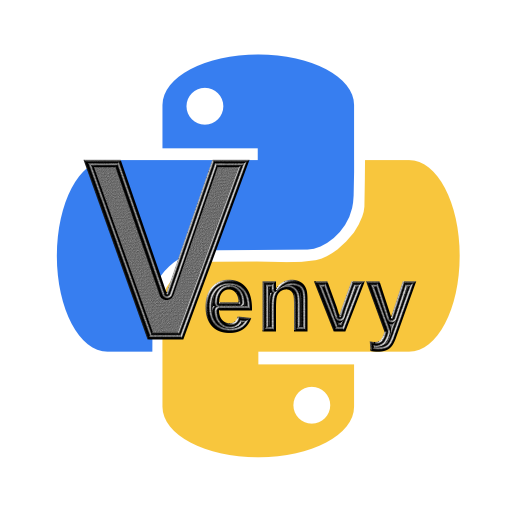

# Venvy: Python Virtual Environment Manager for VS Code

## Introduction

Venvy is a Visual Studio Code extension that simplifies the process of setting up and activating Python virtual environments. With just one click, you can either create a new virtual environment or activate an existing one right in your project directory. Say goodbye to manually entering commands each time you start a new Python project!

## Features

- **One-Click Setup**: Create a Python virtual environment in your project folder with a single click.
- **Automatic Activation**: If a virtual environment already exists, Venvy will activate it for you.
- **Status Bar Integration**: Venvy sits in the status bar for quick and easy access.

## Installation

1. Open Visual Studio Code.
2. Go to the Extensions view by clicking on the square icon in the sidebar, or press `Ctrl+Shift+X`.
3. At the top of the EXTENSIONS view, click the three little dots in the top right corner.
4. Choose "Install from VSIX..." in the menu that pops up.
5. Browse to the extension (example:  venvy-1.0.0.vsix) and click INSTALL. 

## How to Use

After installation, you'll see a `Activate Venv` button in the status bar at the bottom of the VS Code window. (Defaults to bottom right corner.)

- **Creating a New Virtual Environment**: Click the `Activate Venv` button. If a virtual environment doesn't exist in your project folder, Venvy will create one for you.
  
- **Activating an Existing Environment**: If a virtual environment already exists in your project folder, clicking the `Activate Venv` button will activate it.

## Prerequisites

- Python must be installed on your system.
- The Python executable should be accessible from the command line (i.e., `python` or `python3` should work when entered in the terminal).
- You should have the appropriate filesystem permissions to create directories and files in your project folder.
- Ensure you have npm installed (node.js installer for your system)
- To create the VSIX file:  open a terminal or command prompt, cd to the directory containing the source. Type this:  npm install -g vsce, then this:  vcse package
- Follow the INSTALLATION above.

## Known Issues

- The extension assumes you are working in a VS Code workspace.

## Contributing

Feel free to open issues or PRs on the [GitHub repository](https://github.com/QuantumPixelator/Venvy)!

## License

This extension is licensed under the MIT License. Do whatever you want with it. :)
